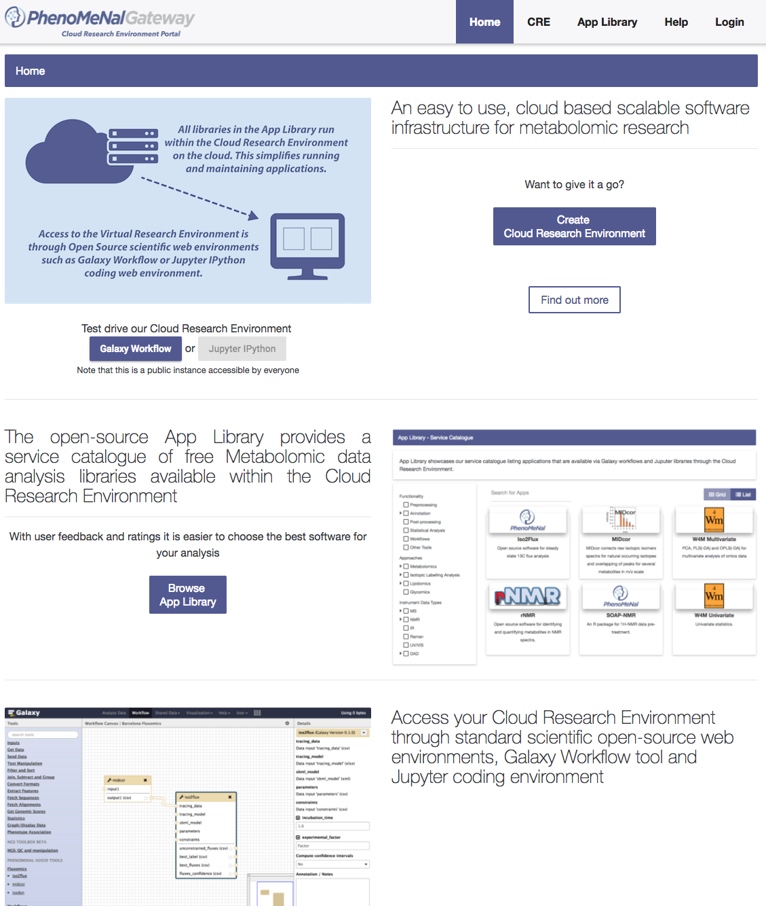

# PhenoMeNal Portal
Version: 0.2.2

## Short Description

PhenoMeNal Portal for Cloud Research Environment Deployment

## Description


## Key features

- Local Cloud Research Environment Deployment

## Functionality

- Other Tools

## Screenshots

Screen shots obtained from the original PhenoMeNal Portal page.



## Tool Authors

- Sijin He (EMBL-EBI)

## Container Contributors

- [Sijin He](https://github.com/sh107) (EMBL-EBI)

## Website

- http://portal.phenomenal-h2020.eu/


## Git Repository

- https://github.com/phnmnl/container-phenomenal-portal.git

## Installation 

For local individual installation:

```bash
docker pull docker-registry.phenomenal-h2020.eu/phnmnl/phenomenal-portal
```

## Usage Instructions

For direct docker usage:

```bash
docker run -d -p 3000:80 -it portal:0.1.19 nginx -g 'daemon off;'
```

## Publications

<!-- Guidance:
Use AMA style publications as a list (you can export AMA from PubMed, on the Formats: Citation link when looking at the entry).
IMPORTANT: Publications sectio must be placed at the end and cannot be emptied!
-->

- 
