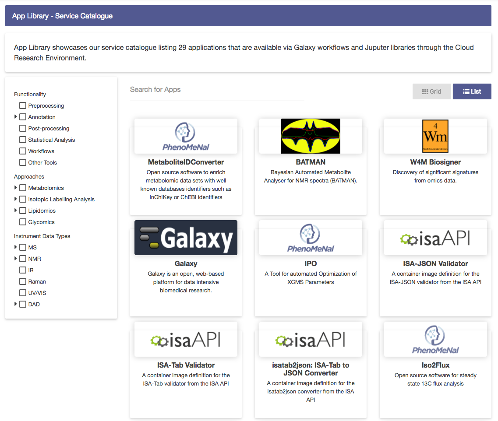
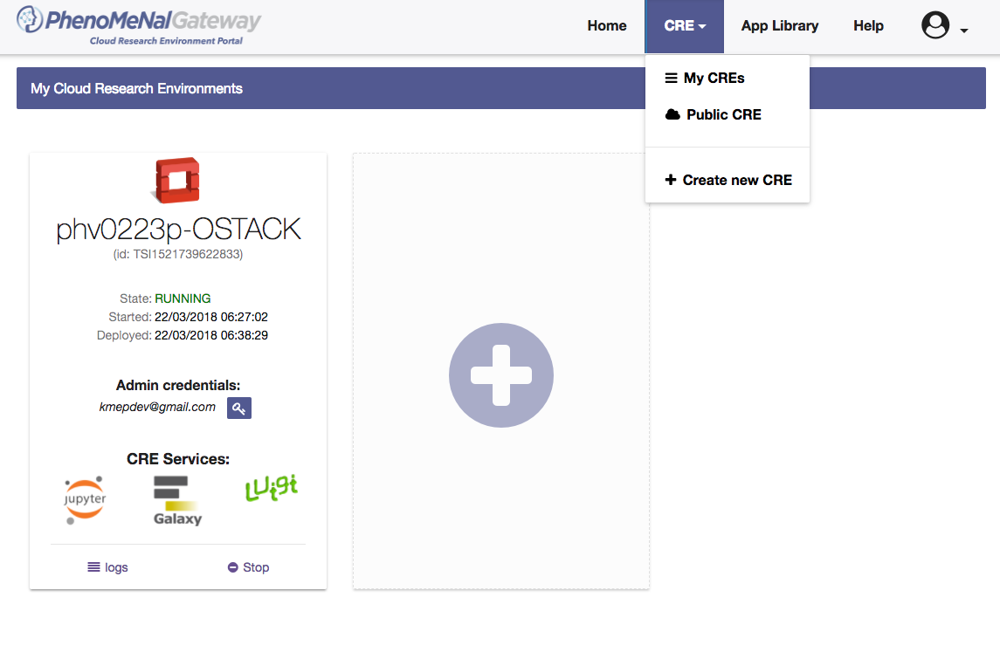

# PhenoMeNal Portal
Version: 2.2.1

## Short Description

PhenoMeNal Portal for Cloud Research Environment Deployment

## Description

The PhenoMeNal Virtual Research Environment (VRE), aka. Virtual Research Community (VRC) will be the central access point for all users. This is the online portal enabling user interactions, virtual machine distribution, access to compute resources and information exchange. Users can search for existing public datasets and perform online analysis. The VRC will interact with the PhenoMeNal middleware to federate on-demand job requests between provisioned data, compute, and analysis resources. Expert help and training will be available through the VRC.


## Key features

- Local Cloud Research Environment Deployment

## Functionality

- Other Tools

## Screenshots

##### Home Page of the PhenoMeNal Portal


---

##### App Library


---

##### CRE Dashboard



## Tool Authors

- Sijin He (EMBL-EBI)
- Pablo Moreno (EMBL-EBI)
- Marco Enrico Piras (CRS4)

## Container Contributors

- [Sijin He](https://github.com/sh107) (EMBL-EBI)
- [Pablo Moreno](https://github.com/pcm32) (EMBL-EBI)
- [Marco Enrico Piras](https://github.com/kikkomep) (CRS4)

## Website

- http://portal.phenomenal-h2020.eu/


## Git Repository

- https://github.com/phnmnl/container-phenomenal-portal.git

## Installation 

For local individual installation:

```bash
docker pull container-registry.phenomenal-h2020.eu/phnmnl/phenomenal-portal
```

## Usage Instructions

For direct docker usage:

```bash
docker run -d -p 3000:80 -it container-registry.phenomenal-h2020.eu/phnmnl/phenomenal-portal nginx -g 'daemon off;'
```


<!-- Guidance:
Use AMA style publications as a list (you can export AMA from PubMed, on the Formats: Citation link when looking at the entry).
IMPORTANT: Publications sectio must be placed at the end and cannot be emptied!
-->


